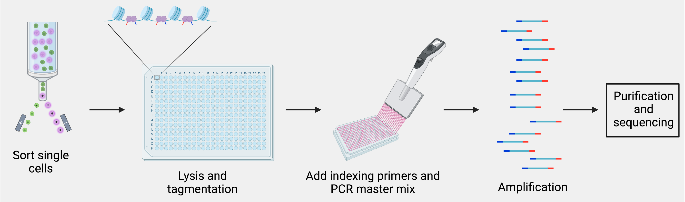
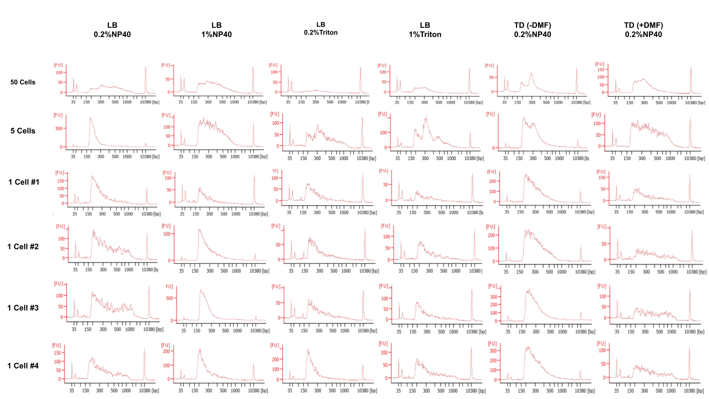
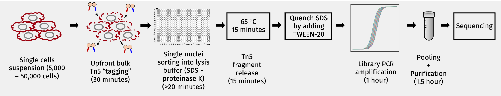
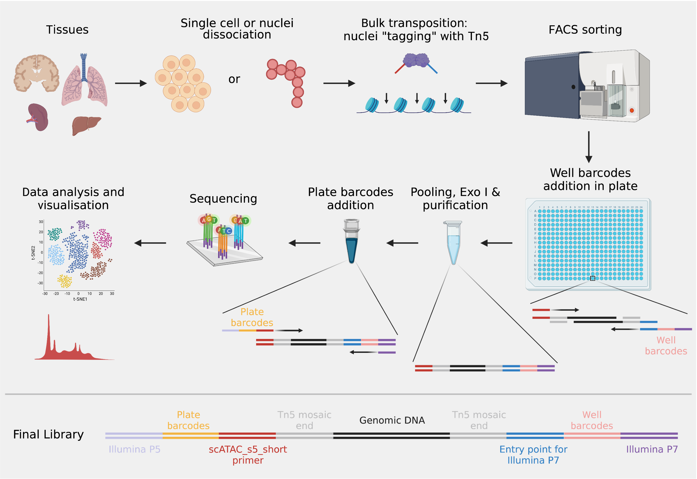
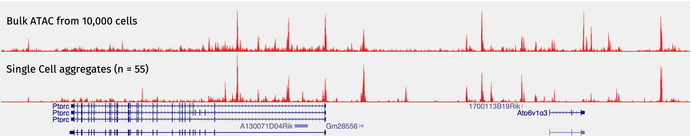

In 2013, the **a**ssay for **t**ransposase-**a**ccessible **c**hromatin using **seq**uencing (ATAC-seq) [was developed](https://www.nature.com/articles/nmeth.2688). It remains as the simplest and the most sensitive method for open chromatin profiling. It is a very clever use of the transposase Tn5. Based on previous studies from many different labs and [the ENCODE project](https://www.encodeproject.org), people knew that different cell types had quite distinct open chromatin profiles. Back then, it was natural for the community to think about developing a method to perform ATAC-seq at the single cell level (scATAC-seq). In that way, you not only get to use the data to discriminate different cell types, but have the gene regulatory information of each cell type as well.

At the beginning, we thought we could just follow a similar workflow from a typical single-cell RNA-seq (scRNA-seq) experiment, like [SMART-seq2](https://www.nature.com/articles/nmeth.2639). That is, sort each single cell into individual wells of a plate, perform tagmentation in each well and keep adding other reaction components into the same wells without intermediate purification steps. Like this: 

How hard was that? Well ... it turned out to be very hard! If we just did what was shown above, it would fail. The situation was more complicated than we expected. First, we needed a lot of Tn5 for a single experiment, because the tagmentation was done separately for each single cell in the well. In addition, the final library profiles ended up like this:

You don't really need to care about the labels, because they are just different tagmentation conditions that we were testing. They are all failed libraries. For a typical successful ATAC-seq experiment, you would expect at least three peaks in the DNA fragment of the final library, including the 146-bp adapters: a 200-bp peak  representing fragments from nucleosome-free regions, a 350-bp peak representing fragments from mono-nucleosome regions and a 550-bp peak representing fragments from di-nucleosome regions. In the failed libraries shown above, most of them only have a major peak at 200 bp. By the way, the "empty well no cell" control libraries also look at like that. Only a few of them, *e.g.* row #1 column #5 and row #2 column #4, have some sort of nucleosome ladder patterns. However, the nucleosomal peaks are around 300 bp and 500 bp. There is a 50-bp shift. After sequencing, all of the above libraries have a very low mapping rate (<10%). Apparently, the reads came from contamination, although we did not really figure out the source of the contamination.

In 2015, [Buenrostro *et al.*](https://doi.org/10.1038/nature14590) from William Greenleaf's and Howard Chang's labs and [Cusanovich *et al.*](https://doi.org/10.1126/science.aab1601) from Jay Shendure's lab developed two methods for getting ATAC-seq to work at the single cell level. The former used the **Fluidigm C1** microfluidics platform to capture single cells in small chambers and perform tagmentation and pre-amplification in the machine. It was like scaling down the bulk ATAC-seq reaction volume proportionally to the single cell level, which could not be achieved in regular PCR plates. It worked nicely on many cell lines. However, anybody who has used the Fluidigm machine knows that the cells are captured in a chip, called **integrated fluidics circuit (IFC)** if I recall correctly. The chip requires the diameter of the cell to be within a certain range. Although they provide different chips with different size requirements, the performance (in terms of the capture and the doublet rates) is not great. It is not robust enough for the daily use. The latter used the combinatorial indexing strategy to perform mini-bulk ATAC-seq with barcoded Tn5 and indexed PCR to get the scATAC-seq done without the actual isolation of single cells. The method was called **sci-ATAC-seq**, and the design was really clever. In order to do sci-ATAC-seq, you needed a large amount of high-quality Tn5 assembled with many indexed oligos, which was difficult to obtain back then.

We wanted a simpler and more robust way of performing scATAC-seq, so that everybody could use it easily. The sci-ATAC-seq design gave us some hints, and the **Figure 1** from [the CPT-seq paper](https://doi.org/10.1038/ng.3119) made us aware of one key property of Tn5. When the transposition reaction is finished, the transposase Tn5 remains bound to the targeted DNA. The targeted DNA is only fragmented after removing Tn5 using either denaturing agents, such as SDS, or heat. Then we realised that we could simply take the advantage of this property and perform a regular bulk ATAC-seq up to the stage of the transposition reaction. Since the DNA was not fragmented after the bulk transposition reaction, the nuclei remained intact. We could just sort or hand pick single nuclei into wells of PCR plates containing SDS and perform indexing PCR. Of course SDS will inhibit the PCR, but that problem could be solved by [adding non-ionic detergents](https://doi.org/10.1101/gr.4.6.368). Therefore, we came up with the following strategy:

Once we adapted this "upfront transposition in bulk, then sorting" strategy, everything worked smoothly without any problems. The method was published in [December 2018](https://doi.org/10.1038/s41467-018-07771-0). We are not the only people that came up with this strategy. [Chen *et al.*](https://doi.org/10.1038/s41467-018-07115-y) from Howard Chang's lab also published a similar method, which they called pi-ATAC-seq, in the same journal one month ahead of ours.

Moving forward, we were not entirely satisfied with the plex capacity of our method. In our plate-based scATAC-seq method, each single cell is amplified individually, and the cell barcodes come from the [Illumina Nextera indices](https://support.illumina.com/sequencing/sequencing_kits/nextera-xt-index-kit-v2/contents-storage.html) which are simply the combinations of the **i5** and the **i7** indices. With the Illumina Nextera index sets, we can only sequence a maximum of 384 cells per run. Therefore, we need to design our own to make sequencing more cells at once possible. If you read enough plate-based scRNA-seq methods, you will realise that many of them use one side of **i5** or **i7** as the plate index, and the other the well index. In this way, cell pooling becomes very flexible and you can sequence as many plates at once as you want.

Therefore, we updated our method and provided a detailed step-by-step protocol in 2021 ([Xu *et al.* 2021](https://doi.org/10.1038/s41596-021-00583-5)). In the paper, we had a detailed discussion of many aspects of the method, including the logic behind the experimental design, the advantages and limitations of the method and typical results of successful and failed experiments. In addition, more scATAC-seq methods become available over the past few years. We also summarised and compared them in technical terms to help people choose one that suits their needs. The current workflow of our method is like this:

Finally, there is something interesting we really want to explore further next. When we performed the scATAC-seq profiling of the mouse splenocytes, we noticed we got 55 macrophages out of >3,000 cells. The low frequency of this cell type in the mouse spleen was expected. When we aggregated those 55 macrophages and looked at the reads pileup on the genome browser, it turned out the signal was as good as the bulk macrophage ATAC-seq from 10,000 cells by [the ImmGene consortium](https://www.immgen.org):

This was surprising to us, because we know that bulk ATAC-seq with ~50 cells would not work based on our experience. Actually, the original ATAC-seq paper showed that bulk ATAC-seq with ~500 cells already had compromised signal-to-noise ratios. However, the aggregated data from only 50 cells look very similar to the bulk ATAC-seq from tens of thousands of cells. We did not know the exact reasons, but it seemed the upfront transposition in bulk was much more efficient than in single cells. This observation provides an opportunity to profile chromatin accessibilities for rare cells. Basically, rare cells of interest can be labelled first by surface protein antibodies or fluorescent RNA/DNA probes. Then Tn5 tagging can be performed in bulk. Subsequently, cells of interest can be isolated by FACS, if the fluorescent signals can survive those experimental procedures. Finally, libraries can be generated for those sorted cells only.

We know this should be possible, because we have already done some proof-of-principle tests. Next, we need to develop something that works in general.

Stay tuned!