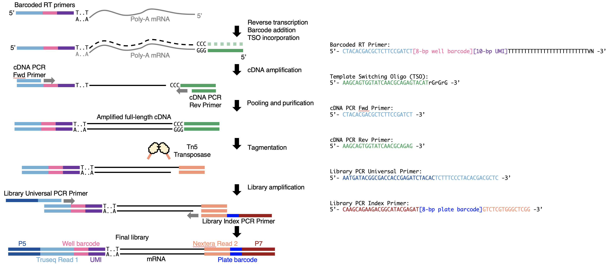

Over the past 10 years, we saw the field of single cell RNA-seq (scRNA-seq) shifting from deep sequencing of a small number of cells to shallow sequencing of a large number of cells. Many studies (*e.g.* [Guo *et al.*, 2010](https://doi.org/10.1016/j.devcel.2010.02.012), [Macosko *et al.*, 2015](https://doi.org/10.1016/j.cell.2015.05.002), [Cao *et al.*, 2017](https://doi.org/10.1126/science.aam8940) and [Schmid *et al.,* 2021](https://doi.org/10.1038/s41467-021-26779-7)) have demonstrated the necessity of sequencing large quantities of cells. The large number of cells is important for the identification of cell types and differential expression *etc*. That's one of the reasons why the number of cells per publication has been [increasing exponentially](https://doi.org/10.1101/742304).

We know that the per cell cost is cheap now, but what actually matters in reality is the per experiment cost. Sometimes, you don't really need a lot of cells. This is especially true when doing  pilot tests to find out the correct experimental conditions for new samples or new methods. It would be expensive and unnecessary to do tens of thousands of cells. Many would just use the [SMART-seq family](https://teichlab.github.io/scg_lib_structs/methods_html/SMART-seq_family.html) methods for the test, but the Tn5 cost is high and the separate library preparation for each cell is labour intensive. We basically want a flexible plate-based method that works in the range of hundreds of cells, *i.e.* a couple of 96w or 384w plates.

In most cases, we just need the gene expression levels, which can be achieved by 3' sequencing. Therefore, we think we could just do a SMART-seq like experiment up to the stage of cDNA, then only sequence the 3' end. Therefore, we came up with this workflow:

In this case, we can control the number of cells we profiled and cost spent on the experiment. On top of that, we only need to do one library per plate, which really reduces the hands-on time. This workflow has been used in the lab for quite a long time. We are invited to contribute a chapter for [Methods in Molecular Biology](https://www.springer.com/series/7651) book series [Embryonic Stem Cell Protocols (2022)](https://link.springer.com/book/10.1007/978-1-0716-2437-1). Therefore, we organised our protocol and included many experimental details and tricks into a chapter where you can read by [clicking here](./7651_2021_435.pdf).

Now that I think about it, this is essentially a [10x Genomics](https://www.10xgenomics.com/support/single-cell-gene-expression) in plates. It is also very similar to [mcSCRB-seq](https://doi.org/10.1038/s41467-018-05347-6). We still call it a modified SMART-seq3 method, because the reaction components are all based on [SMART-seq3](https://doi.org/10.1038/s41587-020-0497-0).