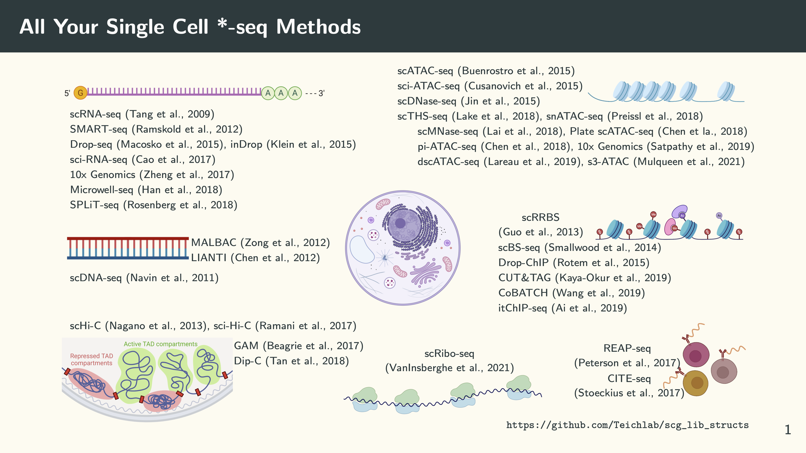
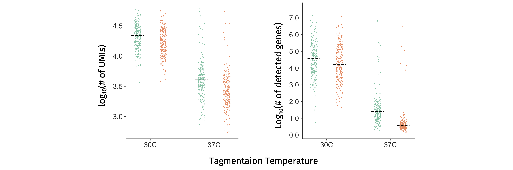

Several months ago in the [NSFC/RGC Workshop on Single-Cell Data Science](https://singlecell2022.hku.hk), we made a slide of many common single cell sequencing methods:

The list was far from complete. Yet it was already overwhelming. The point is that we have many methods that sequence different types of molecules in a cell. Of course, when sequencing single cells, we want to use the molecules that we sequence to define cell types or cell states if you will ... Then one question emerges naturally: among all those things we can sequence which one is the best to tell the state of a cell? How about a combination of some of them? This makes intuitive sense, because those different types of molecules provide related but complementary information of a cell. People are very keen on developing single-cell multi-omics methods that can sequence a combination of different types of molecules (*e.g.* RNA, DNA, mC, proteins) from the same single cell. Just look at the long list in the **Multi-omic** section in the [Single Cell Genomics Library Structure](https://github.com/Teichlab/scg_lib_structs) GitHub repo. In 2019, the journal [Nature Methods](https://www.nature.com/nmeth/) deemed the single-cell multi-omics method as [Method of the Year](https://www.nature.com/articles/s41592-019-0703-5).

Since the mechanism of transcriptional regulation is our main research interest, we are particularly interested in developing a method that can simultaneously profile chromatin accessibility or histone modifications and gene expression from the same single cell. This was also motivated by the observation that cells with similar gene expression profiles can have distinct open chromatin and histone modification status and *vice versa* (*e.g.* [in mESCs](https://doi.org/10.1016/j.stem.2014.05.005), [in T cells](https://doi.org/10.15252/embj.201592534) and [in NK cells](https://doi.org/10.1038/s41467-018-07771-0)). Back in 2017 when I came across the [LIANTI](https://doi.org/10.1126/science.aak9787) method from Sunney Xie's lab, I immediately realised that I could just replace the Tn5 in the [scTHS-seq](https://doi.org/10.1038/nbt.4038) with the **LIANTI Tn5**. Then it could be combined with [CEL-seq2](https://doi.org/10.1186/s13059-016-0938-8) seamlessly to profile chromatin accessibility and gene expression. In this way, both the open chromatin fragments and the cDNA fragments can be linearly amplified by a T7 promoter, and every single Tn5 cutting event in the open chromatin regions is theoretically amplifiable. I had the design on an A0 paper documenting the details of the workflow and the oligo sequences. However, that idea was never developed into a method. The reason? Well ... the design and the workflow were too complex which would be unlikely to be adopted by others.

Simplicity is a key thing that is often overlooked during the method development process. In order for a method to be widely used by many groups, it needs to be robust **AND** simple. Here we quote from the Dutch computer scientist Edsger Dijkstra:

> Simplicity is prerequisite for reliability.

We also came up with some other designs over the years, but they were either too complicated or not sensitive enough in terms of the number of genes detected for the gene expression modality. In the meantime, many single-cell multi-omics methods specifically focused on chromatin accessibility or histone modifications + RNA were [developed](https://doi.org/10.1016/j.tig.2022.03.015). Things changed a little bit when we saw [SHERRY](https://doi.org/10.1073/pnas.1919800117) and [TRACE-seq](https://doi.org/10.7554/elife.54919) published in PNAS and eLife, respectively. Those two papers basically had the same take-home message: the transposase Tn5 that we use for ATAC-seq had an RNase H-like domain and can target RNA/DNA hybrid. Taking the advantage of this property, they developed a simple workflow for the RNA-seq library construction.

We were also inspired by this finding and thought this could be incorporated into the single-cell ATAC-seq protocol that we have been doing routinely in the lab to investigate chromatin accessibility and gene expression from the same single cell. The question becomes how do we tell the difference between the reads from open chromatin and those from mRNA? After a few trials, we came with a differential barcoding and dual tagmentation strategy where genomic DNA from open chromatin is tagged by regular Tn5 and mRNA is converted into the RNA/DNA hybrid using a TruSeq Read 2-containing and tagged again by a Tn5 homodimer, like this:

We named it ***i***n ***s***itu **S**HERRY **A**fter **A**TA**C**-seq (**ISSAAC-seq**), with double S'es. The good thing about this design is its simplicity and modularity. All those reagents and equipment required to execute the method are very basic in a typical single-cell lab or genomic core facility. The entire procedure contains two semi-independent modules: an *in situ* reaction and a single-cell isolation modules. You can optimise every step within each module base on your own needs. For example, you could change the reverse transcriptase, the RT condition and the initial starting material *etc*. We just provided an initial setup that worked for us. Based on the number of cells you want to profile, you could choose to use plate or droplet for the single cell isolation, which is very flexible. The design is heavily inspired by many *in situ* single-cell methods which make us realise that the nuclei themselves are very good reaction chambers for many things. Since we could do an upfront bulk reaction to add sequencing adapters to the targeted molecules we want to sequence, the only thing remain after single cell isolation is the PCR amplification. This makes high-throughput profiling of a large quantity of cells very straightforward.

Of course, a new method never works during the first few trials. Actually, it took Wei, the first author, nearly a year to find out the right condition in each reaction step. Initially we kept getting poor-quality RNA data, and we were desperate to find out the problem. Since we have to get the actual sequencing data before doing the next optimisation experiment, we need fast turnaround time. Therefore, we choose to sequence by ourselves using a NextSeq machine. Then flow cells with failed experiments kept piling up:



After testing quite a few factors, we realised that it was the regular tagmentation process that made the RNA library in poor quality[^1]. It could be the "unfriendly" temperature (37C), or RNase contamination, or both. Then we tried to lower down the tagmentation temperature and used different RNase inhibitors. The results obviously suggest that the tagmentation temperature has a bigger effect:

After that, it only takes a few more trials to make the method robust and reliable. The rest are all in the paper, and we are very happy with the final outcome.

That's it. This is just a post to document the whole method development history. Currently, it only works for cell types with strong nuclei, such as brain cells, cell lines *etc.*, because they need to survive all the *in situ* reactions before the single cell/nucleus isolation step. We are still actively improving ISSAAC-seq to make it more sensitive and suitable for a wider range of biological samples. Stay tuned!

[^1]: We will update and talk about how exactly we reach this conclusion in future, but not now, because it has information that is tightly related to another manuscript we are preparing.