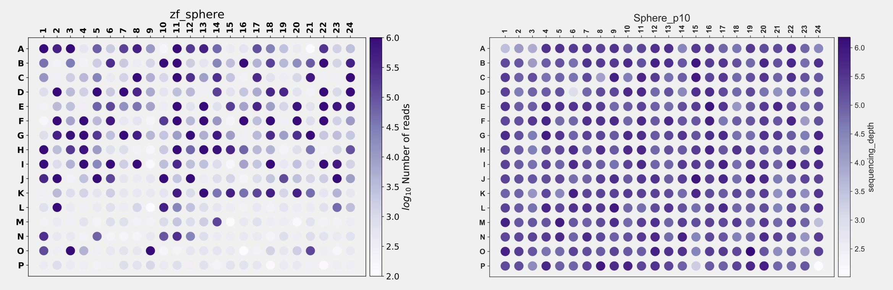

One fundamental question in developmental biology is how a totipotent cell develops into all kinds of different cell types in an organism. During early embryogenesis, there is often a cleavage stage when cells just go through a series of synchronised and rapid cell cycles to produce many cells. At the very early stages, say the 4-cell stage, cells within an embryo are generally thought to be the same and all of them are still totipotent. Intuitively, the cells have to decide what cell types they need to become at some point along the development procedures. Then a question follows naturally: *when is the first time that a cell decides to take a specific fate?* That might be a question too big or too broad to address directly, and we may also end up in a rabbit hole debating on what exactly **cell fate decision** is. The more approachable questions that we could actually investigated are: *when cells become different from one another and what are the differences?*

This is something that needs to be addressed by single-cell methods. We used zebrafish as our model system. Of note, we are not the only people that have thought about this. In 2018, [Farrell, Wang *et al.*](https://doi.org/10.1126/science.aar3131) from the Regev and the Schier labs used **Drop-seq** and [Wagner *et al.*](https://doi.org/10.1126/science.aar4362) from the Megason and the Klein labs used **inDrop** to profile the transcriptomes of over tens of thousands of cells of zebrafish. They generated comprehensive cell atlases of zebrafish early embryogenesis. The atlases covered key developmental stages from 3.3 hours post fertilisation (hpf) up to 24 hpf. They identified key developmental time points when new cell types emerge and the gene expression programs associated with each cell type. In those atlases, the vast majority of the data are after the dome stage (~4.3 hpf). This makes sense since the zebrafish genome remains silent before zygotic genome activation (ZGA) that happens around 3 hpf. The development of embryos are mainly supported by maternal material during those cleavage stages. Therefore, it is only meaningful to investigate the transcriptomes after ZGA.

However, another important layer of regulation of the development and cell fate decision is the chromatin status. Many studies have shown that the chromatin undergoes dramatic changes throughout the entire embryogenesis, including those pre-ZGA stages. Routine observations on embryos suggest that cells already become morphologically different and asynchronised around ZGA. Therefore, an intuitive question to ask is: *when do cells become different from one another for the first time at the chromatin level?* More importantly, do those differences contribute to the cell fate decisions during later development? To this end, maybe it is worthwhile to re-investigate the early embryogenesis using single-cell ATAC-seq, focusing on key time points immediately after ZGA. That was the idea Ni, Wenfei and I came up with on the return trip from a BGI single-cell meeting back in June 2019, many months before the pandemic.

That was one of the first projects that I committed to after coming back to China and join SUSTech. I still vividly remember the scene where we sat in the taxi cab discussing various aspects on zebrafish and medaka that Ni used to work on. After solving some practical problems, the project started. The initial goal was very clear: just use our plate-based single-cell ATAC-seq method to profile zebrafish embryonic cells from 3 hpf (1k) to 4.3 hpf (dome).

As always, it turned out that the project was not going as smoothly as we wanted. The first problem was that the new students had never worked on any single-cell genomic methods. We constantly failed library preparation. Instead of seeing the nice nucleosome phasing pattern of the library on DNA gels, we saw nothing for the first few months. Then we figured out the problem was incorrectly treating the oil droplets from the yolk as cells. Of course we got no libraries from those, because the cells were just not there. Then we had another problem with FACS. After tagmentation, single nuclei needed to be sorted into each individual well in 384-well plates. Again, that was challenging for students who had never done sorting themselves. The first few trials were all look like the picture on the left shown below. The colour indicates the log10 number of reads recovered from each well. After a quite a lot of practice, the problem was finally solved, which looked like the picture shown on the right below. The progress was nice.

The next problem was related to data analysis. Due to the limited number of cells per embryo at the early stages and the short time periods between stages, it was not practical to collect all experiments from all time points in one go. We have to do one time point on one day. In this case, we created batch effects and the experimental workflow was confounded, because each time point was also a batch. Data visualisation without any batch corrections looked like this:



which was totally expected. Apparently, we needed to perform some sort of batch correction to make cells from the same stage mixed together in the UMAP. To be honest, I do not think this "batch removed" UMAP actually gives us new insights, but it is what people normally do. Now that I think about it, since we know what to expect, we should try some semi-supervised methods, but that would be another separate post on its own (stay tuned!). Anyway, to remove the batch effect, we could just use the routine and integrate all of them together:



which resulted in a UMAP that was difficult to interpret, because the time information was not obvious and the two methods gave different information. After many trials with different settings and different methods, we eventually went with default settings of [BBKNN](https://doi.org/10.1093/bioinformatics/btz625):



which gave the best result. Why do I say BBKNN gives the best result? Well ... it is not really based on some metrics. It is purely based on our expectation. Therefore, I cannot say the current UMAP is the ground truth, but it is a nice visualisation. Anyway, the rest of the analysis was basically described in [our paper](https://doi.org/10.1093/nar/gkae095).

During the execution of the project, there were many difficulties. The project was new; the lab was new; we needed to get used to the equipment and environment *etc.* The most difficult thing for me was the many nights of self-doubt. The situation was that we knew this was a competitive field and we might get scooped. We were moving forward very slowly, which did not help. However, for a very long time, there was no paper about this. That was good, but at the same time, it also made us think that we might not be on the right track. Were these questions interesting and important? Were they worth investigating? Did people really care? Why other people haven't done that? Were we missing something?

Those were the questions kept haunting me during the past few years, but I'm glad we did it now. Congratulations to all co-authors. We made it!!  